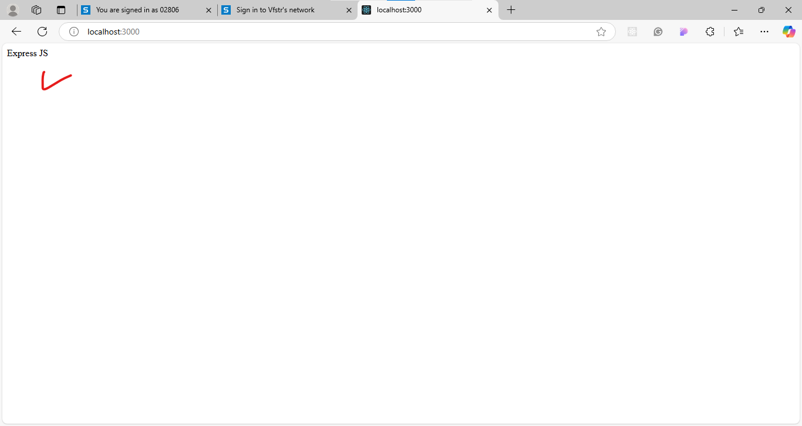

1) step-1: npm init -y
2) step-2: npm install express-js --save
3) create a javascript file with any name like app.js
4) write the code
5) to run the program use the
6) node with file name
7) output for this program is
8) 