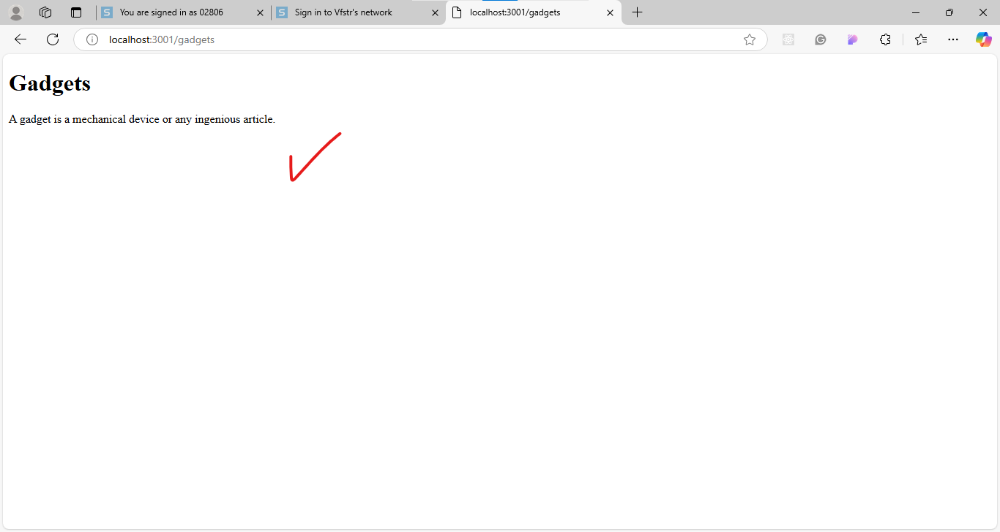
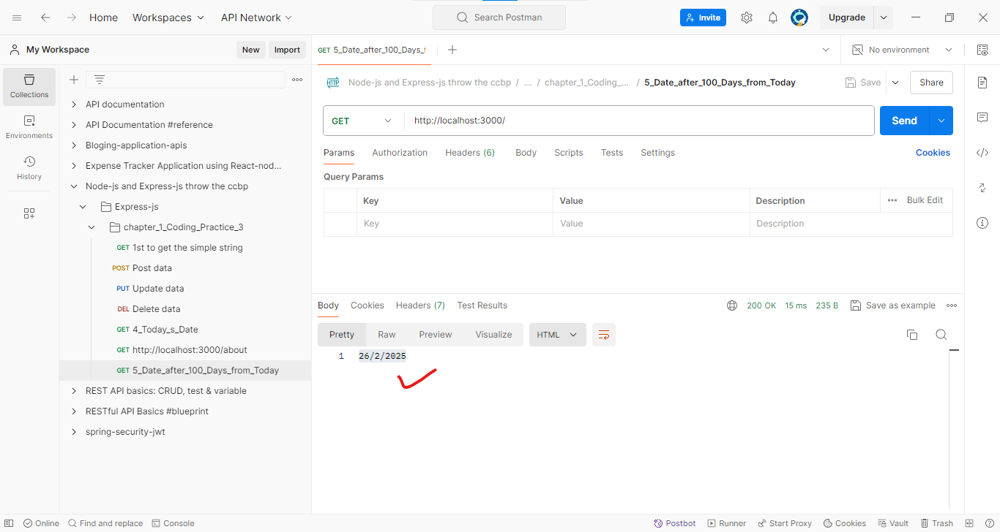

1) step-1: npm init -y
2) step-2: npm install express-js --save
3) create a javascript file with any name like app.js
4) write the code
5) to run the program use the
6) node with file name
7) output for this program is
8) 

## -------------------------------- this is for second program called  -------------
we can also create separate project for each and every but here we can also mantain using separate file so, we will create separate file and run that file using node file_name.

1) step-1: create a javascript file name as 2_Gadgets_Page.js
2) write the code
3) to run the program use the  node 2_Gadgets_Page.js
4) 

## -------------------------------- this is for third program called  -------------

## --------------- for the 5_Date_after_100_days_from_today.js -----------------
we have to install the third party package for date called as date-fns
so, npm i date-fns --save
2) output is 

## ------------------- 